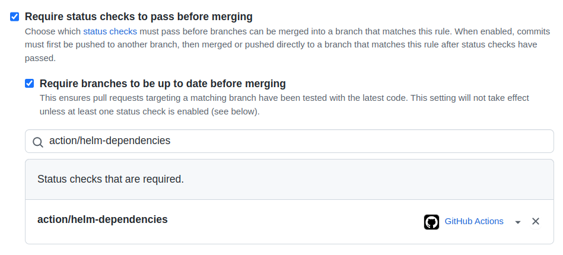

# actions

* [kube-do](#kube-do-action)
* [bootstrap](#bootstrap-action)
* [kube-secrets](#kube-secrets-action)
* [helm-dependencies](#helm-dependencies-action)
* [helm-lint](#helm-lint-action)
* [discord](#discord-action)
* [development](#development)

For a working example see [kube-template](https://github.com/hckops/kube-template/blob/main/.github/workflows/kube-do.yml)

### kube-do-action

[](https://github.com/hckops/actions/actions/workflows/test-kube-do.yml)

> Manages DigitalOcean Kubernetes cluster lifecycle

Creates or deletes clusters based on a config definition
```diff
# examples/kube-test-do-lon1.yaml
version: 1
name: test-do-lon1
provider: digitalocean
+ status: UP
- status: DOWN

digitalocean:
  cluster:
    count: 1
    region: lon1
    size: s-1vcpu-2gb
```

Example
```bash
- name: Provision
  uses: hckops/actions/kube-do-action@main
  with:
    access-token: ${{ secrets.DIGITALOCEAN_ACCESS_TOKEN }}
    config-path: examples/kube-test-do-lon1.yaml
    wait: true
```

Requires `DIGITALOCEAN_ACCESS_TOKEN` secret
* [How to Create a Personal Access Token](https://docs.digitalocean.com/reference/api/create-personal-access-token)
* Create a [Personal Access Token](https://cloud.digitalocean.com/account/api/tokens)

How to test it locally
```bash
# build image
docker build -t hckops/kube-do-action ./kube-do-action

# run action
docker run --rm \
  -e GITHUB_REPOSITORY="INVALID_GITHUB_REPOSITORY" \
  -e GITHUB_OUTPUT="INVALID_GITHUB_OUTPUT" \
  -v ${PWD}/examples:/examples \
  hckops/kube-do-action \
    "INVALID_GITHUB_TOKEN" \
    "INVALID_ACCESS_TOKEN" \
    "./examples/kube-test-do-lon1.yaml" \
    "main" \
    "true" \
    "false" \
    "false"
```

TODOs
- [ ] replace implementation with [Terraform](https://docs.digitalocean.com/reference/terraform)?

### bootstrap-action

[](https://github.com/hckops/actions/actions/workflows/test-bootstrap.yml)

> Bootstraps a platform with ArgoCD

Example
```bash
- name: Bootstrap
  uses: hckops/actions/bootstrap-action@main
  with:
    argocd-admin-password: ${{ secrets.ARGOCD_ADMIN_PASSWORD }}
    argocd-git-ssh-key: ${{ secrets.ARGOCD_GIT_SSH_KEY }}
    kubeconfig: <REPOSITORY_NAME>-kubeconfig.yaml
    chart-path: ./charts/argocd-config
```

Requires
* `ARGOCD_ADMIN_PASSWORD` secret
    - [User Management](https://argo-cd.readthedocs.io/en/stable/operator-manual/user-management)
    - [How to change admin password](https://argo-cd.readthedocs.io/en/stable/faq/#i-forgot-the-admin-password-how-do-i-reset-it)
    ```bash
    docker run --rm -it python:3-alpine ash
    pip3 install bcrypt

    # create secret with bcrypt hash
    python3 -c "import bcrypt; print(bcrypt.hashpw(b'<MY-PASSWORD>', bcrypt.gensalt()).decode())"
    ```
* `ARGOCD_GIT_SSH_KEY` secret
    - [Generate a new SSH key pair](https://help.github.com/en/articles/generating-a-new-ssh-key-and-adding-it-to-the-ssh-agent#generating-a-new-ssh-key)
    ```bash
    # generate ssh key pair
    ssh-keygen -t ed25519 -C "argocd@example.com" -N '' -f /tmp/id_ed25519_argocd

    # add public key to a github user account with access to the repo
    cat /tmp/id_ed25519_argocd.pub | xclip -selection clipboard

    # create secret with private key
    cat /tmp/id_ed25519_argocd | xclip -selection clipboard

    # cleanup
    rm /tmp/id_ed25519_argocd*
    ```

How to test it locally on minikube
```bash
# see "scripts/local.sh"
make bootstrap
# default cluster
make bootstrap kube="template"

# admin|argocd
kubectl port-forward svc/argocd-server -n argocd 8080:443
```

### kube-secrets-action

[](https://github.com/hckops/actions/actions/workflows/test-kube-secrets.yml)

> Initializes operator's master Secret

Supports
* [External Secrets Operator](https://external-secrets.io)
* [LastPass Operator](https://github.com/edgelevel/lastpass-operator)

Example
```bash
# AKEYLESS
- name: Secrets
  uses: hckops/actions/kube-secrets-action@main
  with:
    kubeconfig: <REPOSITORY_NAME>-kubeconfig.yaml
    operator: external-secrets-akeyless
    external-secrets-akeyless-access-id: ${{ secrets.AKEYLESS_ACCESS_ID }}
    external-secrets-akeyless-access-type: api_key
    external-secrets-akeyless-access-type-param: ${{ secrets.AKEYLESS_ACCESS_KEY }}

# LASTPASS
- name: Secrets
  uses: hckops/actions/kube-secrets-action@main
  with:
    kubeconfig: <REPOSITORY_NAME>-kubeconfig.yaml
    operator: edgelevel-lastpass
    edgelevel-lastpass-username: ${{ secrets.LASTPASS_USERNAME }}
    edgelevel-lastpass-password: ${{ secrets.LASTPASS_PASSWORD }}
```

Requires
* `AKEYLESS_ACCESS_ID` and `AKEYLESS_ACCESS_KEY` secrets for [Akeyless](https://www.akeyless.io)
    - In *Auth Methods*, create new *API Key* e.g. `kube-template-action`
    - In *Access Roles*, create new *Role* e.g. `template-role`, *Associate Auth Method* to the api key previously created and *Add Rule for Secrets & Keys*
    ```bash
    # returns AKEYLESS_ACCESS_TOKEN
    curl --request POST \
      --url https://api.akeyless.io/auth \
      --header 'accept: application/json' \
      --header 'content-type: application/json' \
      --data '{"access-type": "access_key", "access-id": "<AKEYLESS_ACCESS_ID>", "access-key": "<AKEYLESS_ACCESS_KEY>"}'

    # verify access rules
    curl --request POST \
      --url https://api.akeyless.io/get-secret-value \
      --header 'accept: application/json' \
      --header 'content-type: application/json' \
      --data '{"names": ["/path/to/MY_SECRET"], "token": "<AKEYLESS_ACCESS_TOKEN>"}'
    ```
* `LASTPASS_USERNAME` and `LASTPASS_PASSWORD` secrets for [LastPass](https://www.lastpass.com)

### helm-dependencies-action

[](https://github.com/hckops/actions/actions/workflows/test-helm-dependencies.yml)

> Keeps [Helm](https://helm.sh) dependencies up to date

See also https://github.com/dependabot/dependabot-core/issues/2237

Example
```bash
# workflow example
- name: Helm Dependencies
  uses: hckops/actions/helm-dependencies-action@main
  with:
    user-email: "<EMAIL>"
    user-name: "<USERNAME>"
    config-path: examples/dependencies.yaml
  env:
    GITHUB_TOKEN: ${{ secrets.GITHUB_TOKEN }}

# config example
dependencies:
  # it will fetch the latest dependency from https://artifacthub.io/packages/helm/argo/argo-cd
  # and create a pr with the updated version using jq/yq path in Chart.yaml
  - name: "Argo CD"
    source:
      file: examples/test-chart/Chart.yaml
      path: .dependencies[0].version
    repository: 
      type: artifacthub
      name: argo/argo-cd
```

For more example see
* [dependencies](https://github.com/hckops/actions/blob/main/examples/dependencies.yaml)
* [workflow](https://github.com/hckops/kube-template/blob/main/.github/workflows/helm-dependencies.yml)

How to test it locally, sample [output](docs/helm-dependencies-local.txt)
```bash
# build image
docker build -t hckops/helm-dependencies-action ./helm-dependencies-action

# dry run without creating a pr
docker run --rm \
  --env GITHUB_TOKEN=INVALID_TOKEN \
  --env GITHUB_REPOSITORY=INVALID_REPOSITORY \
  --env GITHUB_SHA=INVALID_SHA \
  --volume ${PWD}/examples:/examples \
  hckops/helm-dependencies-action \
    "examples/dependencies.yaml" \
    "INVALID_EMAIL" \
    "INVALID_USERNAME" \
    "main" \
    "true"
```

#### Recommendations 

* Automatically delete branches, see `https://github.com/<OWNER>/<REPOSITORY>/settings`


* Suggest to update branches, see `https://github.com/<OWNER>/<REPOSITORY>/settings`


* Favour squashed PRs to keep a clean commit history


* Enable default branch protection, see `https://github.com/<OWNER>/<REPOSITORY>/settings/branches`. The action pushes a status check named **`action/helm-dependencies`** upon success



#### Troubleshooting

* If you get the following error, *pull request create failed: GraphQL: GitHub Actions is not permitted to create or approve pull requests (createPullRequest)*
    - make sure you've enabled `Allow GitHub Actions to create and approve pull requests` in your organization and repository settings
    - `https://github.com/organizations/<ORGANIZATION>/settings/actions`
    - `https://github.com/<OWNER>/<REPOSITORY>/settings/actions`


### helm-lint-action

[](https://github.com/hckops/actions/actions/workflows/test-helm-lint.yml)

> Validates [Helm](https://helm.sh) charts

Example
```bash
- name: Helm Lint
  uses: hckops/actions/helm-lint-action@main
```

TODOs
- [ ] rename to `kube-validate`
- [ ] add https://github.com/yannh/kubeconform
- [ ] add https://github.com/koalaman/shellcheck

### discord-action

[](https://github.com/hckops/actions/actions/workflows/test-discord.yml)

> Interacts with Discord API

Example of *Create message*
```bash
- name: Notification
  uses: hckops/actions/discord-action@main
  with:
    action: create-message
    webhook-url: ${{ secrets.DISCORD_WEBHOOK_URL }}
    message: "Hello World"
```

Requires `DISCORD_WEBHOOK_URL` secret
* [Intro to Webhooks](https://support.discord.com/hc/en-us/articles/228383668-Intro-to-Webhooks)

How to test it locally
```bash
DISCORD_WEBHOOK_URL="INVALID_URL"
make discord-create webhook=${DISCORD_WEBHOOK_URL} message=test

docker build -t hckops/discord-action ./discord-action
docker run --rm hckops/discord-action "create-message" ${DISCORD_WEBHOOK_URL} "docker"
```

## Development

### Docker images

[](https://github.com/hckops/actions/actions/workflows/docker-ci.yml)

> Action's base images

* [DockerHub](https://hub.docker.com/u/hckops)

```bash
# run command
docker run --rm hckops/kube-base /bin/bash -c <kubectl|helm>

# start temporary container
docker run --rm --name hck-tmp -it hckops/kube-<base|argo|aws|do>
```

How to publish docker images
```bash
# publish with action
git tag docker-X.Y.Z
git push origin --tags

# build and publish manually (old)
make docker-build
make docker-publish version=vX.Y.Z token=<ACCESS_TOKEN>
make docker-clean
```

Actions to update when a new docker tag is created
* `bootstrap-action`
* `helm-dependencies-action`
* `helm-lint-action`
* `kube-do-action`
* `kube-secrets-action`

### minikube

* [Documentation](https://minikube.sigs.k8s.io)

```bash
# install 
curl -LO https://storage.googleapis.com/minikube/releases/latest/minikube_latest_amd64.deb
sudo dpkg -i minikube_latest_amd64.deb

# local cluster
minikube start --driver=docker --embed-certs
minikube delete --all

# verify status
kubectl get nodes
```
